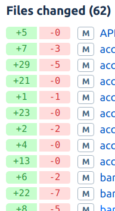
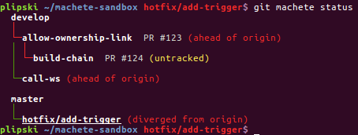
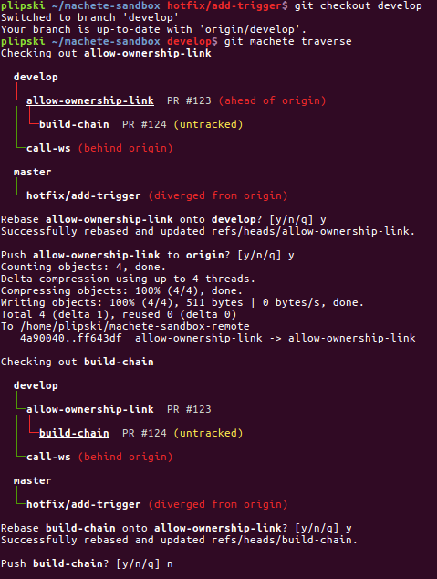
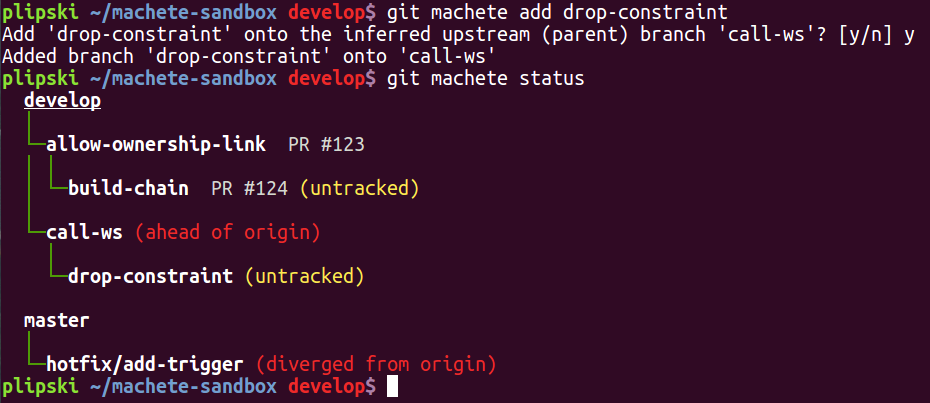

TODO: remove hostname from screens!!!!!!!!!!!
TODO: remove hostname from screens!!!!!!!!!!!
TODO: remove hostname from screens!!!!!!!!!!!
TODO: remove hostname from screens!!!!!!!!!!!
TODO: remove hostname from screens!!!!!!!!!!!
TODO: remove hostname from screens!!!!!!!!!!!
TODO: remove hostname from screens!!!!!!!!!!!

# `git machete` strikes again! Traverse the git (rebase) jungle even faster with v2.0


## Intro

Good news - git machete 2.0 has been released!
For those of you not familiar with this nifty tool, I recommend having a quick look at the [previous part of this series (link)](https://virtuslab.com/blog/make-way-git-rebase-jungle-git-machete)...
or at least scrolling through the screenshots in that blog post to get a TL;DR kind of understanding what git machete actually does.

You can get the latest git machete release directly from [the git machete repo (github.com/PawelLipski/git-machete)](https://github.com/PawelLipski/git-machete):

```bash
$ git clone https://github.com/PawelLipski/git-machete.git
$ cd git-machete
$ sudo make install
```

`make install` copies the `git-machete` Python 2.7 executable to `/usr/local/bin` and sets up the corresponding Bash completion script in `/etc/bash_completion.d`.

Some of the latest improvements (especially automatic dependency inference) have been suggested on Reddit discussion - many thanks for the feedback.
Also, special thanks for the GitHub user [sprudent](https://github.com/sprudent) who raised an issue regarding the crashes of git machete when run from a git submodule.
Other recent tweaks to git machete were introduced simply to make the day-to-day use of the tool even more convenient.

TODO!!!!!!!!!!!!  In terms of rationale/big picture for using git machete, this also has been widely discussed on Reddit thread
also about that is better to split work into smaller PRs b/c they're easier to review and stuff - another rationale for git machete in general

TODO describe


As in the first part of the series, there is a dedicated script that sets up a demo repository with a couple of branches -
you can download it [directly from GitHub (link)](https://raw.githubusercontent.com/PawelLipski/git-machete-blog-2/master/sandbox-setup-2.sh).

One tricky thing with this script is that it actually sets two repos - one at `~/machete-sandbox` and another one at `~/machete-sandbox-remote`.
The latter is a _bare_ repository (created with `git init --bare`) - that is, a one that doesn't have working tree, just `.git` folder.
This will serve as a local dummy remote repo for the one under `~/machete-sandbox`.
The script runs `git remote add origin ~/machete-sandbox-remote` from `~/machete-sandbox` directory
so as to establish an actual local/remote relation between the repos, with the push/pull capabilities that are available over HTTPS or SSH.

Structure of branches in the demo (i.e., the contents of the definition file, excluding custom annotations that we'll cover soon) is as follows:

```
develop
    allow-ownership-link
        build-chain
    call-ws
master
    hotfix/add-trigger
```


## Which PR was that... custom annotations and improved remote sync-ness status

For most local branches (possibly other than dependency tree roots, like `develop` or `master`), at some point you'll create a pull request on e.g. GitHub or Bitbucket.
It can get pretty inconvenient to "optically" match branch names as displayed by `git branch` or `git machete status` to PRs...
especially in case of Bitbucket which by default doesn't display source branch names in the PR list, only the destination branch.

To make dealing with all such auxiliary information like PR numbers easier, `git machete status` got a simple tweak recently: custom annotations.
Simply put any phrase after the branch name, separated with a single space (there's an implicit assumption here that you never put spaces in git branch names... if you do, think it over twice!),
and it will be displayed in the output of `status` subcommand.
To be precise, anything can be placed as annotation, not only PR number specifially... but PR numbers seem the most natural use case.

The annotations were already set up by the `sandbox-setup-2` script.
Let's run `git machete status`:



The PR numbers are here completely arbitrary here, since the script obviously didn't set up any actual PRs on any external service.

You could also notice that the output slighly changed in terms of remote-syncness message.
What was cumbersome in the earlier versions of git machete was that you couldn't really distinguish between an untracked branch and a one that is tracked but is not in sync with its upstream.
As of v2.0 of git machete, `status` distinguishes between (roughly) the following cases:

* untracked
* in sync with remote
* ahead of origin
* behind origin
* diverged from origin

pretty much just like `git status` does.

Now it's also more consistent with `git status` in that it uses the remote tracking branch information (as set up by `git branch --set-upstream` or `git push --set-upstream`)
to determine the remote counterpart branch, rather than simply matching branches by name.


## Too lazy to think what to rebase next... dependency tree traversal

The sequence of steps suggested in the first blog post (TODO link to section!), namely:

* check out a branch X
* rebase it on the top of its upstream
* push with force to remote if needed
* check out another branch - a child of X

is actually quite repetitive in a daily work with `git machete`, esp. when you receive a lot of remarks on review and push fixes in rounds.

To free yourself from thinking about what to check out next, you can check a kind of wizard that walks (or rather, traverses) the branch dependency tree and
suggests what needs to be done next to restore sync of branches with their parent branches and remotes - it's called `traverse`.

Let's check out the `develop` branch (which is a root of the dependency tree) and then iterate through the branches.



What happened here is that we started from `develop` and instantly moved to `allow-ownership-link`.
`allow-ownership-link` wasn't originally in sync with `develop`

The traversal is performed by moving to `next` of each branch (just like doine of `git machete go next`).
More specifically, this is equivalent to a pre-order depth-first search of the tree - each node (i.e. each git branch) visited (and possibly synced) before any of its children are visited.
A manner like this makes sense since you definitely want to put each branch `X` in sync with its parent branch first before syncing `X`'s children to `X` itself.

For the sake of brevity it isn't included in this blog post, but if we were to continue the traversal, then we'll first encounter

for ??? we weren't asked to rebase onto ??? since the branches were already aligned.
Similiarly, `traverse` didn't suggest to push ??? since it was already in sync with origin/???


## Don't remember what depended on what... branch dependency inference

If you plan to add some existing local branch to the dependency tree, but you don't remember what it actually depended on in the first place...

The demo script sets up a branch `drop-constraint` that is not yet managed by git machete (i.e. not listed in the definition file).

Now let's try and do `git machete add drop-constraint`:



Since the desired upstream branch wasn't specified (no `--onto` option was provided), `add` subcommand inferred the `drop-constraint`'s upstream with a little use of log/reflog magic...
actually, somewhat similar to the one used for `fork-point` (as described in the first part of the series).

TODO remove {
	That's too complicated to outline in details, but in general it is based on a similar trick as the algorithm for determining the fork point:

	To infer the upstream branch for a branch X
	reflogs of all other local branches Y are compared to the logs of (roughly) the reflog-wise earliest commits ever done on X.

	Then, if ...

	Some extra measures are taken to make sure that no cycles occur (so that we actually end up with a tree of branches and not some arbitrary graph).
}

What's more, this inference is not just limited to adding a single branch - it can even be performed on a repository where there is no `.git/machete` file yet to infer the entire dependency tree with a single command!

For demonstration purposes, let's now remove the `.git/machete` file (so as to make sure we don't provide `git machete` with any hint) and run `git machete infer`:


`infer` gives the choice to either accept the inferred tree with `y[es]`, `e[dit]` the tree or reject the suggested version with `n[o]`.
In case of `yes`/`edit`, the old definition file (if it already exists) will be saved under `.git/machete~` (note the added tilde).

In the above scenario `infer` guessed the entire tree properly by careful analysis of branch reflog.
A parent was basically inferred for every single local branch independently... and later some tricks (inspired by [disjoint-set data structure](https://en.wikipedia.org/wiki/Disjoint-set_data_structure)) were done to prevent cycles in the inferred graph.
The only thing that obviously could not be inferred were custom annotations.

At this point one can ask a question: why then do we even need the definition file since we can always infer the upstreams on the fly when doing `status`, `update` etc.?
The reason against that is that ???we don't want everything to happen automagically.
We need to leave a sensible amount of control in the hands of the developer while still helping ???

